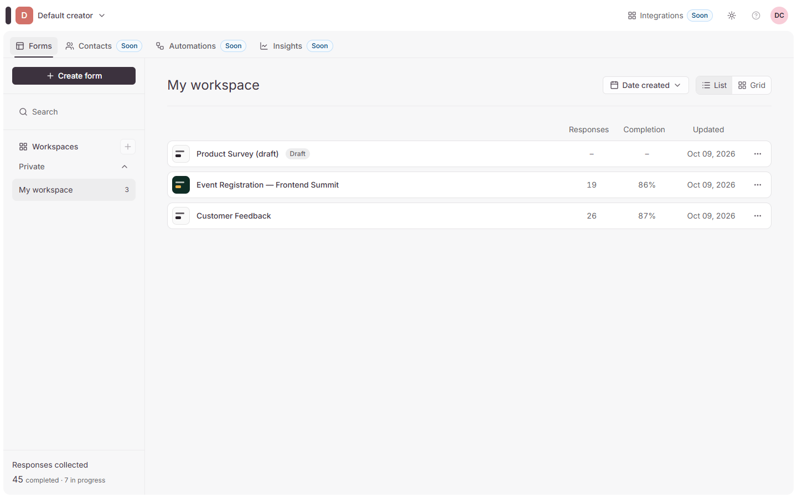
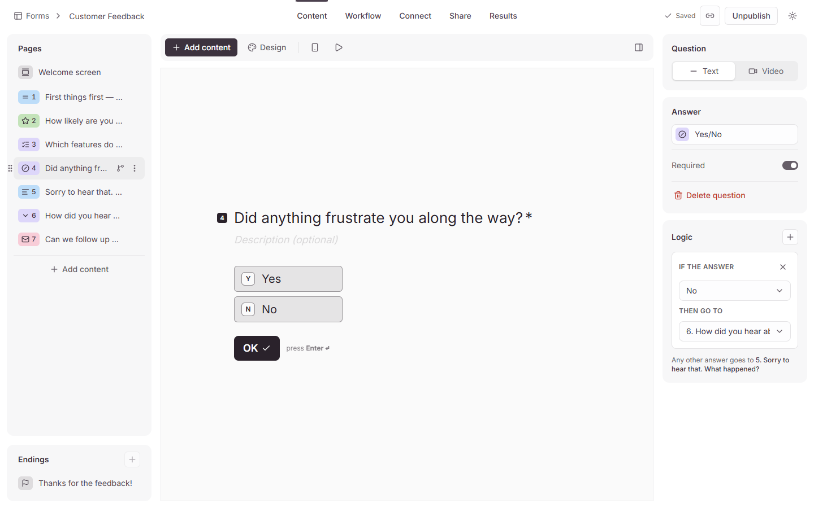
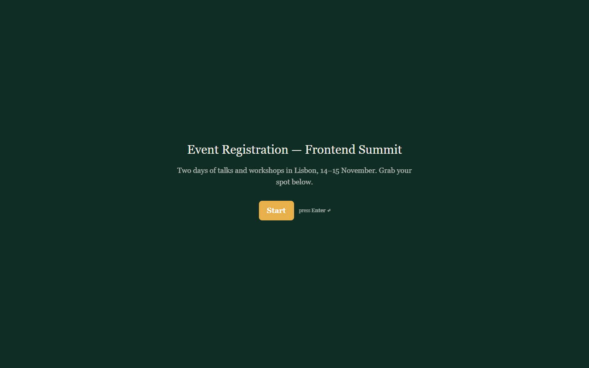
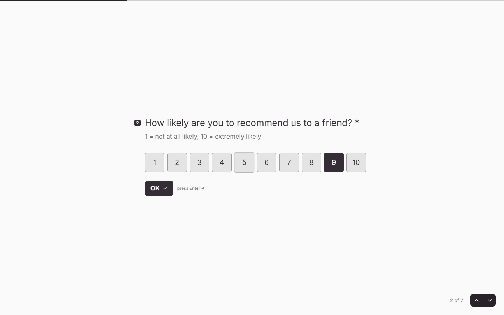
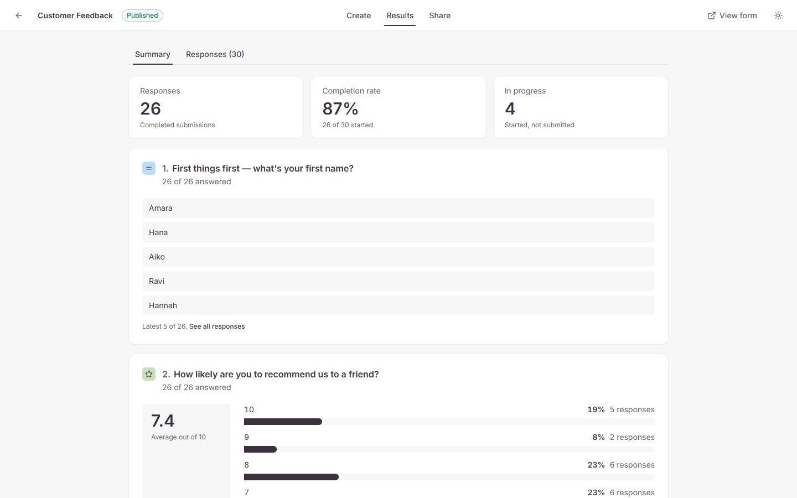
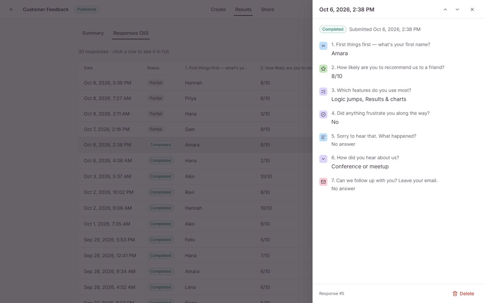
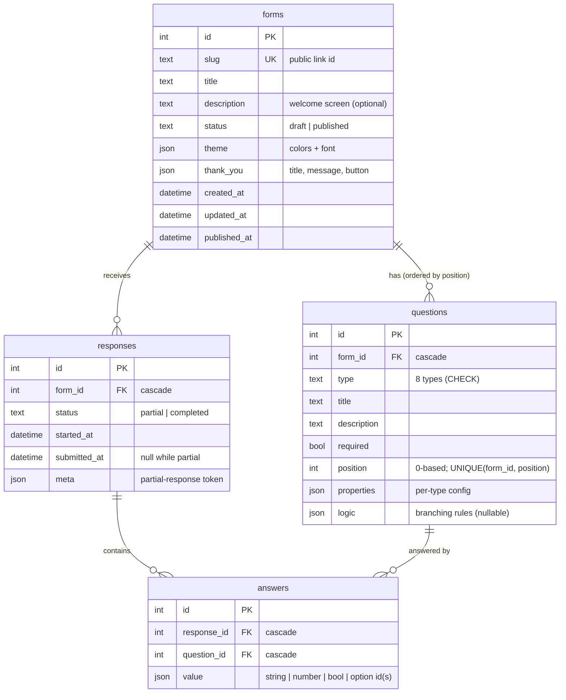

# Typeform Clone

> **Unofficial clone built for an assignment. Not affiliated with or endorsed by Typeform.** The Typeform name and logo belong to Typeform; they appear only in the creator UI to match the original.

A functional clone of [Typeform](https://www.typeform.com): build a form, publish it, share a public link, collect answers one question at a time, and review the results. Built for the SDE Fullstack assignment with **Next.js + TypeScript**, **FastAPI** and **SQLite**.

| Dashboard | Builder (with logic jumps) |
|---|---|
|  |  |
| **Public form (themed welcome screen)** | **One question at a time** |
|  |  |
| **Results summary** | **Single response** |
|  |  |

More: [multiple choice in a custom theme](docs/screenshots/04-respondent-choice.png) · [builder in dark mode](docs/screenshots/08-builder-dark.png)

---

## Quick start

**Prerequisites:** Node.js 20+ and Python 3.11+ on your `PATH` (`python` on Windows, `python3` elsewhere).

```bash
npm install       # root dev tooling (concurrently)
npm run setup     # backend .venv + pip install, frontend npm install, creates backend/.env + frontend/.env.local
npm run seed      # demo data: 2 published forms with 52 responses, 1 draft (safe to re-run)
npm run dev       # API on http://localhost:8000, app on http://localhost:3000
```

Open **http://localhost:3000**. Interactive API docs are at http://localhost:8000/docs. On a fresh machine, setup and seeding took about 75 seconds.

Prefer to run the halves yourself?

```bash
# backend
cd backend
python -m venv .venv && source .venv/Scripts/activate   # macOS/Linux: source .venv/bin/activate
pip install -r requirements.txt
cp .env.example .env
python -m app.seed
uvicorn app.main:app --reload --port 8000

# frontend (second terminal)
cd frontend
npm install
cp .env.example .env.local
npm run dev
```

### Demo data
`npm run seed` creates three forms. It skips any that already exist (matched by slug) and only adds responses to a seeded form that has none.

| Form | Status | What it shows |
|---|---|---|
| **Customer Feedback** (`/f/demo-feedback`) | Published | Welcome screen, 7 question types, 1–10 rating, a logic jump (“Did anything frustrate you?” → **No** skips the follow-up), 30 responses (4 partial) |
| **Event Registration — Frontend Summit** (`/f/demo-event`) | Published | Custom theme (dark green, gold buttons, Georgia), 7 question types incl. number, a logic jump (Day pass skips workshops), custom thank-you button, 22 responses (3 partial) |
| **Product Survey (draft)** | Draft | Unpublished: its public link shows “not available” |

Responses are generated from a fixed random seed, so every machine gets the same data. Timestamps are spread over the last 30 days. Every generated response passes the real server validation, including branching. To start over, stop the API, delete `backend/app.db` and run `npm run seed` again.

### Configuration
| File | Variable | Default |
|---|---|---|
| `backend/.env` | `DATABASE_URL` | `sqlite:///./app.db` (relative to `backend/`) |
| `backend/.env` | `CORS_ORIGINS` | `http://localhost:3000` (comma-separated) |
| `frontend/.env.local` | `NEXT_PUBLIC_API_URL` | `http://localhost:8000/api` |

### Checks
```bash
npm run test:backend     # pytest: 101 tests on a temporary database
npm run typecheck        # tsc --noEmit
npm run lint             # eslint
npm run build:frontend   # next build
```

---

## Features

### Must-haves
- **Form management:** card dashboard with status, response count and last update. Search and sort. Create, rename, duplicate, delete with confirm. Publish / unpublish, a share modal and copy link. Everything is persisted.
- **Builder:**
  - Inline form title.
  - The 8 question types: short text, long text, multiple choice (single or multi), dropdown, email, number (min/max), yes/no, rating (3–10; stars, hearts or numbers).
  - Per-question title, description and *required* toggle, plus type-specific settings.
  - Drag-and-drop reordering, with keyboard and screen-reader support.
  - A live canvas preview built from the real respondent components, and a full-screen preview.
  - Autosave with a *Saving… / Saved* indicator. Failed saves roll back with a toast.
- **Respondent flow (`/f/{slug}`, no login):**
  - Full screen, one question at a time, with slide transitions.
  - Progress bar and “n of N”.
  - Enter / ↑ / ↓ / letter, Y/N and number shortcuts. Auto-advance after a single pick.
  - Client validation mirrored by authoritative server validation. Server errors jump back to the offending question.
  - Retry toast on network errors, then the thank-you screen.
- **Results:**
  - Summary tab with totals, completion rate and a card per question: choice bar charts, rating average and distribution, number min/avg/max, latest text answers.
  - Responses tab: table with one column per question, pagination, a full-response drawer and delete.
- **Typeform feel:** conversational layout, modals, inline editing, toasts, empty / loading / error states, 404 and error pages, and settings for theme and thank-you screen.

### Bonuses
- **Branching / logic jumps:** for each question, rules like “if the answer is X → jump to question Y / end the form”. You add them in the Logic section of a question’s settings, and Settings → Logic shows an overview. Jumps only go forward, so a form can never loop. Progress, “n of N”, back navigation and server validation all follow the respondent’s actual path.
- **Partial responses and completion rate:** a response is started when the respondent first moves forward and is saved on every step. The results page shows completed vs in-progress responses and the completion rate.
- **Custom themes:** background, text and button colors plus font, applied to the builder preview and the public form.
- **Dark mode:** a Light / Dark / System switch for the dashboard, builder and results. Forms keep their own theme.
- **CSV export** of all responses: readable values, opens correctly in Excel, protected against formula injection.

### Placeholders (“Coming soon”, disabled)
Integrations and Collaborate under Settings. Payment and File upload in the *Add question* menu.

---

## Tech stack
| Layer | Choice |
|---|---|
| Frontend | Next.js 16 (App Router) · React 19 · TypeScript · Tailwind CSS v4 |
| UI state & data | TanStack Query (server cache, optimistic updates) · Zustand (builder editing state) |
| Interaction | framer-motion (transitions) · dnd-kit (drag and drop) · sonner (toasts) · lucide-react (icons) |
| Backend | FastAPI · Pydantic v2 · SQLAlchemy 2 |
| Database | SQLite (`backend/app.db`; tables created on API startup) |
| Tests | pytest + FastAPI `TestClient` on a temporary database |

## Architecture

```
backend/app/
  main.py          app factory, CORS, routers, error handlers
  core/            settings, DB session (SQLite FK pragma), {detail} error format
  models/          SQLAlchemy models: Form, Question, Response, Answer
  schemas/         Pydantic request/response models; per-type question properties; logic rules
  routers/         forms · questions · public · responses (thin: parse → service → schema)
  services/        business logic: forms, questions (renumbering), validation, logic (branching),
                   submissions (incl. partial), responses, stats, export (CSV)
  seed.py
frontend/
  app/             routes: /forms (dashboard) · /forms/[id]/edit · /forms/[id]/results · /f/[slug] (public)
  components/      ui/ (primitives) · dashboard/ · builder/ · respondent/ · results/
  lib/             api client, types (mirror the API), validation + logic (mirror the server), queries
  store/           builder store + per-key debounced autosave queue
```

Key decisions:
1. **The public URL uses a random slug** (`/f/k3Jd9xQ2`); internal ids are integers. Only published forms are served publicly; drafts return 404 so their existence isn't revealed.
2. **One `questions` table.** Type-specific config (options, rating max, number range…) lives in a validated `properties` JSON column, so adding a type doesn't add a table.
3. **One `answers` row per (response, question)** with a JSON value, which keeps stats and CSV export simple.
4. **Validation and branching rules exist on both sides.**
   - `services/validation.py` and `services/logic.py` are authoritative.
   - `lib/validation.ts` and `lib/logic.ts` mirror them, with the same messages, for instant feedback.
5. **The live preview reuses the respondent components** in a `preview` mode, so the builder canvas, the full preview and the public page can't drift apart.
6. **Builder autosave:**
   - The Zustand store is the source of truth while editing.
   - Changes are saved per key with a debounce, and saves for the same key run in order.
   - Reordering sends the full order in one transaction.
   - On failure, the store rolls back to the last server copy.

Request flow for a respondent:
1. `GET /api/public/forms/{slug}` loads the form.
2. On the first move forward, `POST …/responses/start` creates a partial response.
3. Every later move sends `PATCH /api/public/responses/{id}` with the answers so far.
4. On the last question, the same `PATCH` with `complete: true` makes the server validate the respondent's path and mark the response completed.
5. The thank-you screen shows.

More detail: [`docs/ARCHITECTURE.md`](docs/ARCHITECTURE.md).

## Database schema



- CHECK constraints on `type` and `status`. `UNIQUE(response_id, question_id)` on answers.
- Indexes on `questions(form_id, position)`, `responses(form_id, status)`, `answers(question_id)` and `forms(slug)`.
- Deleting a form cascades to its questions, responses and answers. Deleting a question deletes its answers and removes jumps that point to it.
- Value formats, `properties` per type and the logic format are in [`docs/DATABASE_SCHEMA.md`](docs/DATABASE_SCHEMA.md).

## API summary
Base path `/api`. Errors are always `{"detail": "message"}`. Validation errors (422) are `{"detail": {"errors": {"<field or question id>": "message"}}}`.

| Area | Endpoints |
|---|---|
| Forms | `GET /forms` · `POST /forms` · `GET/PATCH/DELETE /forms/{id}` · `POST /forms/{id}/duplicate` · `POST /forms/{id}/publish` · `POST /forms/{id}/unpublish` |
| Questions | `POST /forms/{id}/questions` · `PATCH/DELETE /questions/{qid}` · `PUT /forms/{id}/questions/order` |
| Public | `GET /public/forms/{slug}` · `POST /public/forms/{slug}/responses` · `POST /public/forms/{slug}/responses/start` · `PATCH /public/responses/{rid}` |
| Results | `GET /forms/{id}/responses?page&page_size&status` · `GET/DELETE /forms/{id}/responses/{rid}` · `GET /forms/{id}/summary` · `GET /forms/{id}/responses/export.csv` |

Full request and response shapes: [`docs/API_SPEC.md`](docs/API_SPEC.md), or the live OpenAPI docs at `/docs`.

## Assumptions
- **No auth.** Everything belongs to a single default creator. Builder and results URLs use the numeric form id. Only the public form is meant to be shared.
- **Deletes cascade.** Deleting a form removes its questions, responses and answers. Deleting a question removes its answers, and the builder asks first when the form has responses.
- **Response counts and stats cover completed responses only.** Partial responses appear in the totals, the completion rate and the table.
- **A question's type is immutable.** To change it, delete the question and add a new one.
- **Empty optional answers aren't stored.** Text is trimmed.
- **Answers to questions that a jump skipped are dropped.**
- **Branching is forward-only.** If a reorder makes a rule point backwards, the rule is skipped at fill time and the builder flags it.
- **Multi-select answers are stored in the creator's option order.** If an option is deleted, older answers show it as “(removed choice)”.
- **The welcome screen appears only when the form has a description.** In the builder, pick “Welcome screen” in Pages and type a description on the canvas to turn it on.
- **The last question never auto-submits.** Neither does any question whose answer can end the form. Submitting always takes OK or Enter.

## Known limitations
- No field for the form description (the welcome screen) in the builder. It can be set through the API, and the seeded forms have one.
- The builder is desktop-first. Below 1024 px its three columns become one pane at a time (Pages / Canvas / Settings), and the section tabs (Workflow, Share, Results…) are hidden below 768 px.
- A question's type can't be changed after it's added (delete it and add another).
- The redesign (Typeform look, in progress) covers the workspace and builder; the create flow with Gemini “Create with AI”, the Share page with its publish animation, results and respondent screens are next. See `docs/design/`.
- Logic rules can't be reordered.
- Abandoned partial responses are kept. Reloading mid-form starts a new partial response.
- The same browser can submit a form more than once.
- The responses table has no status filter in the UI (the API supports `?status=`). The drawer's newer/older buttons stay within the current page.
- No migrations (Alembic). After a schema change, delete `backend/app.db` and re-seed.

## Project docs
Specs, design notes and the phase-by-phase build log are in [`docs/`](docs/README.md). [`docs/PROGRESS.md`](docs/PROGRESS.md) records decisions, verification runs and known issues.

All code in this repository was written for this assignment.
