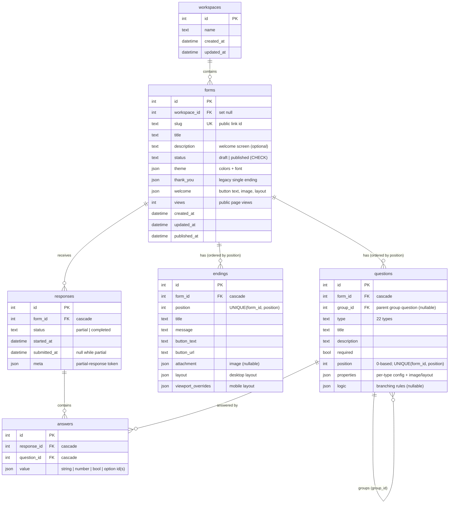

# Typeform Clone

> **Unofficial clone built for an assignment. Not affiliated with or endorsed by Typeform.** The Typeform name and logo belong to Typeform; they appear only in the creator UI to match the original.

A functional clone of [Typeform](https://www.typeform.com): build a form, publish it, share a public link, collect answers one question at a time, and review the results. Built for the SDE Fullstack assignment with **Next.js + TypeScript**, **FastAPI** and **SQLite**.

**Live demo:** https://typeform-mu-seven.vercel.app (frontend on Vercel) · API: https://typeform-production-3059.up.railway.app/api (Railway, OpenAPI docs at [`/docs`](https://typeform-production-3059.up.railway.app/docs)). No login: a default creator is assumed.

| Dashboard | Builder (with logic jumps) |
|---|---|
|  |  |
| **Public form (themed welcome screen)** | **One question at a time** |
|  |  |
| **Results summary** | **Single response** |
|  |  |

More: [multiple choice in a custom theme](docs/screenshots/04-respondent-choice.png) · [builder in dark mode](docs/screenshots/08-builder-dark.png)

---

## Quick start

**Prerequisites:** Node.js 20+ and Python 3.11+ on your `PATH` (`python` on Windows, `python3` elsewhere).

```bash
npm install       # root dev tooling (concurrently)
npm run setup     # backend .venv + pip install, frontend npm install, creates backend/.env + frontend/.env.local
npm run seed      # demo data: 2 published forms with 52 responses, 1 draft (safe to re-run)
npm run dev       # API on http://localhost:8000, app on http://localhost:3000
```

Open **http://localhost:3000**. Interactive API docs are at http://localhost:8000/docs. On a fresh machine, setup and seeding took about 75 seconds.

Prefer to run the halves yourself?

```bash
# backend
cd backend
python -m venv .venv && source .venv/Scripts/activate   # macOS/Linux: source .venv/bin/activate
pip install -r requirements.txt
cp .env.example .env
python -m app.seed
uvicorn app.main:app --reload --port 8000

# frontend (second terminal)
cd frontend
npm install
cp .env.example .env.local
npm run dev
```

### Demo data
`npm run seed` creates three forms. It skips any that already exist (matched by slug) and only adds responses to a seeded form that has none.

| Form | Status | What it shows |
|---|---|---|
| **Customer Feedback** (`/f/demo-feedback`) | Published | Welcome screen, 7 question types, 1–10 rating, a logic jump (“Did anything frustrate you?” → **No** skips the follow-up), 30 responses (4 partial) |
| **Event Registration — Frontend Summit** (`/f/demo-event`) | Published | Custom theme (dark green, gold buttons, Georgia), 7 question types incl. number, a logic jump (Day pass skips workshops), custom thank-you button, 22 responses (3 partial) |
| **Product Survey (draft)** | Draft | Unpublished: its public link shows “not available” |

Responses are generated from a fixed random seed, so every machine gets the same data. Timestamps are spread over the last 30 days. Every generated response passes the real server validation, including branching. To start over, stop the API, delete `backend/app.db` and run `npm run seed` again.

### Configuration
| File | Variable | Default |
|---|---|---|
| `backend/.env` | `DATABASE_URL` | `sqlite:///./app.db` (relative to `backend/`) |
| `backend/.env` | `CORS_ORIGINS` | `http://localhost:3000` (comma-separated) |
| `backend/.env` | `SEED_DEMO_DATA` | `false`. `true` seeds the demo forms at startup when they're missing (used by the hosted demo; never duplicates) |
| `backend/.env` | `CLOUDINARY_CLOUD_NAME` / `_API_KEY` / `_API_SECRET` | empty: image and file uploads go to a local fake server |
| `backend/.env` | `RAZORPAY_KEY_ID` / `RAZORPAY_KEY_SECRET` | empty: a payment question builds, but paying says "Payments aren't set up yet". Use **test-mode** keys (`rzp_test_…`) from the Razorpay dashboard. The secret stays on the server |
| `frontend/.env.local` | `NEXT_PUBLIC_API_URL` | `http://localhost:8000/api` |

### Checks
```bash
npm run test:backend     # pytest: 525 tests on a temporary database
npm --prefix frontend test   # node:test: 133 tests (validation, logic, media layouts, caches…)
npm run typecheck        # tsc --noEmit
npm run lint             # eslint
npm run build:frontend   # next build
```

End-to-end browser checks run on an isolated stack (ports 3100/8100, throwaway database) so they never touch your data: `npm run e2e:start -- --seed`, then `node docs/superpowers/browser-checks/assignment-smoke.mjs` (the assignment checklist through the UI, 28 checks; needs `playwright-core` and Microsoft Edge), then `npm run e2e:stop`.

---

## Features

### Must-haves
- **Form management:** card dashboard with status, response count and last update. Search and sort. Create, rename, duplicate, delete with confirm. Publish / unpublish, a share modal and copy link. Everything is persisted.
- **Builder:**
  - Inline form title, welcome screen and endings edited on the canvas.
  - The 8 required question types: short text, long text, multiple choice (single or multi), dropdown, email, number (min/max), yes/no, rating (3–10; stars, hearts, numbers…). Also: picture choice, website, phone, date, legal, checkbox, opinion scale, NPS, statement, contact info, address, ranking, matrix and question groups.
  - Per-question title, description and *required* toggle, plus type-specific settings. The answer type can be changed later (after a confirmation).
  - Images on questions, the welcome screen and endings, laid out like Typeform (stack, float/split left or right, wallpaper; separate mobile layout; focal point, brightness, alt text).
  - Drag-and-drop reordering, with keyboard and screen-reader support.
  - A live canvas preview built from the real respondent components, and a full-screen preview.
  - Autosave with a *Saving… / Saved* indicator. Failed saves roll back with a toast.
- **Respondent flow (`/f/{slug}`, no login):**
  - Full screen, one question at a time, with slide transitions.
  - Progress bar and “n of N”.
  - Enter / ↑ / ↓ / letter, Y/N and number shortcuts. Auto-advance after a single pick.
  - Client validation mirrored by authoritative server validation. Server errors jump back to the offending question.
  - Retry toast on network errors, then the thank-you screen.
- **Results:**
  - Summary tab with totals, completion rate and a card per question: choice bar charts, rating average and distribution, number min/avg/max, latest text answers.
  - Responses tab: table with one column per question, pagination, a full-response drawer and delete.
- **Typeform feel:** conversational layout, modals, inline editing, toasts, empty / loading / error states, 404 and error pages, and settings for theme and thank-you screen.

### Bonuses
- **Branching / logic jumps:** for each question, rules like “if the answer is X → jump to question Y / end the form”. You add them in the Logic section of a question’s settings, and Settings → Logic shows an overview. Jumps only go forward, so a form can never loop. Progress, “n of N”, back navigation and server validation all follow the respondent’s actual path.
- **Partial responses and completion rate:** a response is started when the respondent first moves forward and is saved on every step. The results page shows completed vs in-progress responses and the completion rate.
- **Custom themes:** background, text and button colors plus font, applied to the builder preview and the public form.
- **Dark mode:** a Light / Dark / System switch for the dashboard, builder and results. Forms keep their own theme.
- **CSV export** of all responses: readable values, opens correctly in Excel, protected against formula injection.
- **File upload question:** drag-and-drop or choose a file (10MB limit), with upload progress; the file goes straight to Cloudinary and results link to it.
- **Payment question (Razorpay):** the respondent types an amount (within the creator's minimum and maximum, optionally pre-filled) and pays in Razorpay Checkout; the creator picks the currency (INR, USD, EUR, GBP), business name and description. The server opens the order, then re-checks the payment with Razorpay when the response is submitted (signature, paid, same amount, made for that question, not used by another response). Results show the amount and payment id, plus the total collected.
- **Extras:** a template gallery (18 templates, "Use template" makes a real draft), a Share page (link, QR code, embed code), workspaces, multiple endings, and Typeform AI (Gemini) to draft a form or edit it by chat.

### Placeholders (“Coming soon”, disabled)
Integrations and Collaborate under Settings; Automations and Insights tabs.

### Contacts (built, modelled on Typeform's)
A **Contacts** tab with a persisted contact database: add individually (with the consent step for "Subscribed"), **Add with import** (CSV with column matching), **Auto-add from forms** (and every new submission with an email becomes a contact), search, filters with AND/OR, saved **Contact lists**, editable cells, a detail sidebar (subscription history, sources), bulk delete and CSV export. Limits: one filter group, no custom properties, no data enrichment.

---

## Tech stack
| Layer | Choice |
|---|---|
| Frontend | Next.js 16 (App Router) · React 19 · TypeScript · Tailwind CSS v4 |
| UI state & data | TanStack Query (server cache, optimistic updates) · Zustand (builder editing state) |
| Interaction | framer-motion (transitions) · dnd-kit (drag and drop) · sonner (toasts) · lucide-react (icons) |
| Backend | FastAPI · Pydantic v2 · SQLAlchemy 2 |
| Database | SQLite (`backend/app.db`; tables created on API startup) |
| Tests | pytest + FastAPI `TestClient` on a temporary database |

## Architecture

```
backend/app/
  main.py          app factory, CORS, routers, error handlers
  core/            settings, DB session (SQLite FK pragma), {detail} error format
  core/migrations  ordered, idempotent schema migrations run at startup (existing SQLite files upgrade in place)
  models/          SQLAlchemy models: Workspace, Form, Question, Ending, Response, Answer, ThemeGallery, AiMemory
  schemas/         Pydantic request/response models; per-type question properties; media; logic rules
  routers/         forms · questions · endings · public · responses · templates · themes · workspaces · media · ai
                   (thin: parse → service → schema)
  services/        business logic: forms, questions (renumbering under a write lock), endings, validation,
                   logic (branching), submissions (incl. partial), responses, stats, export (CSV), templates, AI
  templates/       the template gallery, one JSON file per template
  seed.py
frontend/
  app/             routes: /forms (dashboard) · /forms/[id]/edit · /forms/[id]/share · /forms/[id]/results ·
                   /templates · /f/[slug] (public)
  components/      ui/ (primitives) · dashboard/ · builder/ · respondent/ · results/ · share/ · templates/ · ai/
  lib/             api client, types (mirror the API), validation + logic (mirror the server), queries
  store/           builder store + per-key debounced autosave queue
```

Key decisions:
1. **The public URL uses a random slug** (`/f/k3Jd9xQ2`); internal ids are integers. Only published forms are served publicly; drafts return 404 so their existence isn't revealed.
2. **One `questions` table.** Type-specific config (options, rating max, number range…) lives in a validated `properties` JSON column, so adding a type doesn't add a table.
3. **One `answers` row per (response, question)** with a JSON value, which keeps stats and CSV export simple.
4. **Validation and branching rules exist on both sides.**
   - `services/validation.py` and `services/logic.py` are authoritative.
   - `lib/validation.ts` and `lib/logic.ts` mirror them, with the same messages, for instant feedback.
5. **The live preview reuses the respondent components** in a `preview` mode, so the builder canvas, the full preview and the public page can't drift apart.
6. **Builder autosave:**
   - The Zustand store is the source of truth while editing.
   - Changes are saved per key with a debounce, and saves for the same key run in order.
   - Reordering sends the full order in one transaction.
   - On failure, the store rolls back to the last server copy.

Request flow for a respondent:
1. `GET /api/public/forms/{slug}` loads the form.
2. On the first move forward, `POST …/responses/start` creates a partial response.
3. Every later move sends `PATCH /api/public/responses/{id}` with the answers so far.
4. On the last question, the same `PATCH` with `complete: true` makes the server validate the respondent's path and mark the response completed.
5. The thank-you screen shows.

More detail: [`docs/ARCHITECTURE.md`](docs/ARCHITECTURE.md).

## Database schema



- Two small standalone tables: `themes` (the theme gallery: name + theme JSON) and `ai_memory` (notes Typeform AI keeps between chats).
- CHECK constraints on form and response `status` and on question `position`. `UNIQUE(response_id, question_id)` on answers.
- Indexes on `questions(form_id, position)`, `endings(form_id, position)`, `responses(form_id, status)`, `answers(question_id)` and `forms(slug)`.
- Deleting a form cascades to its questions, endings, responses and answers. Deleting a question deletes its answers and removes jumps that point to it.
- Schema changes ship as ordered, idempotent steps in `backend/app/core/migrations.py`, run at startup, so an existing `app.db` upgrades in place.
- Value formats, `properties` per type and the logic format are in [`docs/DATABASE_SCHEMA.md`](docs/DATABASE_SCHEMA.md).

## API summary
Base path `/api`. Errors are always `{"detail": "message"}`. Validation errors (422) are `{"detail": {"errors": {"<field or question id>": "message"}}}`.

| Area | Endpoints |
|---|---|
| Forms | `GET /forms?workspace_id` · `POST /forms` · `GET/PATCH/DELETE /forms/{id}` · `POST /forms/{id}/duplicate` · `POST /forms/{id}/publish` · `POST /forms/{id}/unpublish` |
| Questions | `POST /forms/{id}/questions` · `PATCH/DELETE /questions/{qid}` · `PUT /forms/{id}/questions/order` |
| Endings | `GET/POST /forms/{id}/endings` · `PATCH/DELETE /endings/{eid}` · `PUT /forms/{id}/endings/order` |
| Public | `GET /public/forms/{slug}` · `POST /public/forms/{slug}/views` · `POST /public/forms/{slug}/uploads` (signed file upload) · `POST /public/forms/{slug}/payments/order` (opens a Razorpay order for a payment question) · `POST /public/forms/{slug}/responses` · `POST /public/forms/{slug}/responses/start` · `PATCH /public/responses/{rid}` |
| Results | `GET /forms/{id}/responses?page&page_size&status` · `GET/DELETE /forms/{id}/responses/{rid}` · `POST /forms/{id}/responses/test` · `GET /forms/{id}/summary` · `GET /forms/{id}/responses/export.csv` |
| Templates | `GET /templates?role&goal&type&q` · `GET /templates/{slug}` · `POST /forms/from-template/{slug}` |
| Workspace & design | `GET/POST /workspaces` · `PATCH/DELETE /workspaces/{wid}` · `GET /themes` · `POST /media/sign` (signed image upload) |
| Typeform AI | `POST /ai/forms` · `POST /ai/forms/{id}/questions` · `POST /ai/chat` · `POST /ai/apply` · `GET/PUT /ai/memory` |
| Health | `GET /health` |

Full request and response shapes: [`docs/API_SPEC.md`](docs/API_SPEC.md), or the live OpenAPI docs at `/docs`.

## Assumptions
- **No auth.** Everything belongs to a single default creator. Builder and results URLs use the numeric form id. Only the public form is meant to be shared.
- **Deletes cascade.** Deleting a form removes its questions, responses and answers. Deleting a question removes its answers, and the builder asks first when the form has responses.
- **Response counts and stats cover completed responses only.** Partial responses appear in the totals, the completion rate and the table.
- **Changing a question's answer type keeps the question but not answers of the old type.** The builder asks for confirmation first.
- **Empty optional answers aren't stored.** Text is trimmed.
- **Answers to questions that a jump skipped are dropped.**
- **Branching is forward-only.** If a reorder makes a rule point backwards, the rule is skipped at fill time and the builder flags it.
- **Multi-select answers are stored in the creator's option order.** If an option is deleted, older answers show it as “(removed choice)”.
- **The welcome screen appears only when the form has a description.** In the builder, pick “Welcome screen” in Pages and type a description on the canvas to turn it on.
- **The last question never auto-submits.** Neither does any question whose answer can end the form. Submitting always takes OK or Enter.

## Known limitations
- The builder is desktop-first. Below 1024 px its three columns become one pane at a time (Pages / Canvas / Settings), and the section tabs (Workflow, Share, Results…) are hidden below 768 px.
- The builder canvas draws a slide at the canvas's own width; Typeform draws a fixed 16:9 slide and scales it down.
- No image gallery (Unsplash, video, icons) or image editor; images are uploaded files.
- File uploads: one file per question, 10MB (checked in the browser and on the stored answer; Cloudinary receives the file directly).
- Payments: one amount per payment question, no refunds, coupons, subscriptions or Razorpay webhooks. A payment counts when Razorpay reports it `captured` or `authorized`. Starting an order is open to anyone with the form's link (like submitting), so an abuser could create unpaid orders in your Razorpay account; there is no rate limiting anywhere in this app.
- Logic rules can't be reordered. A richer logic model (v2: conditions on several answers, variables, scoring) is designed but deferred (`docs/superpowers/DEFERRED.md`).
- Template cards have no preview yet.
- Abandoned partial responses are kept. Reloading mid-form starts a new partial response.
- The same browser can submit a form more than once.
- The responses table has no status filter in the UI (the API supports `?status=`). The drawer's newer/older buttons stay within the current page.

## Project docs
Specs, design notes and the phase-by-phase build log are in [`docs/`](docs/README.md). [`docs/PROGRESS.md`](docs/PROGRESS.md) records decisions, verification runs and known issues.

All code in this repository was written for this assignment.
